# Awesome Jev

Public, source-linked examples of Jev, the decision model that TypeSafe AI released on 15 September 2026, used for robot control, 3D and animation work, and related control tasks. Each entry links the original post, names the author and date, quotes the author for every claim and number, and archives the demo video or images in this repository so they stay viewable if the originals disappear. Rights remain with the authors.

Every link was opened and every post read in full on 2026-09-19. Descriptions repeat what the posts say; where a post leaves something out (the robot model, whether a run is simulated, how images reach the model), the entry says so instead of guessing.

## Contents

- [About Jev](#about-jev)
- [Robot control on physical hardware](#robot-control-on-physical-hardware) (2)
- [Robot control in simulation](#robot-control-in-simulation) (8)
- [3D modeling, animation and virtual cameras](#3d-modeling-animation-and-virtual-cameras) (4)
- [Vehicles, drones and games in simulation](#vehicles-drones-and-games-in-simulation) (4)
- [Design tools and robotics data](#design-tools-and-robotics-data) (3)
- [Reported numbers](#reported-numbers)
- [GitHub projects](#github-projects)
- [Directories and coverage](#directories-and-coverage)
- [About the archived media](#about-the-archived-media)
- [Contributing](#contributing)

## About Jev

Jev was announced on 15 September 2026 by Diogo Almeida of TypeSafe AI, who described it as "a new type of frontier AI model that we are releasing today", "optimized for decisions", and claimed "20-200x faster" and "40-400x cheaper (w/ output tokens free)" than chat models ([announcement on X](https://x.com/CompleteSkeptic/status/2099925682726002904), 2026-09-15; vendor claims). The vendor's site is [typesafe.ai](https://typesafe.ai/). The independent hub [systemonemodels.org](https://systemonemodels.org/) describes the model class as "AI classification models that return typed, calibrated decisions instead of text".

The posts below use Jev the same way: the application or simulator sends structured state (JSON, text, or a menu of options), Jev returns one typed choice, often with a confidence value, and separate code executes the motion or edit. Several authors say explicitly that Jev does not take images ([Isaac Sin](https://x.com/IsaacSin12/status/2100833538224668699), [Dmytro Hrybov](https://x.com/dimentary/status/2101018760371171420), the [Askable Arm README](https://github.com/TarunTomar122/jev-askable-arm)).

## Robot control on physical hardware

The two posts whose videos show a real robot. Both authors describe Jev choosing moves without a trained policy.

| Preview | Case |
|---|---|
| <a href="https://frank-zy-dou.github.io/awesome-jev/assets/videos/jev-002-so-101-ball-to-bowl-manipulation-daniiarabdiev.mp4">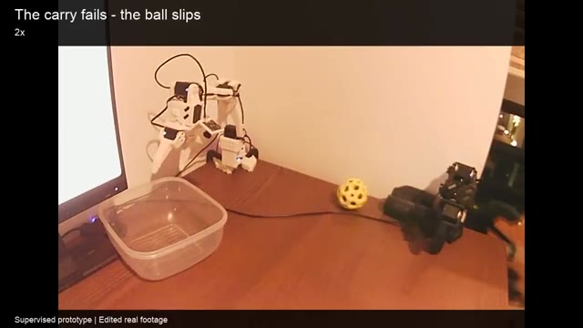</a> | **SO-101 arm picks up a ball and places it in a bowl** [Daniiar Abdiev (@DaniiarAbdiev)](https://x.com/DaniiarAbdiev/status/2100851116498186415), X, 2026-09-18 Author: "Two USB cameras, an SO-101, and @typesafeai's Jev choosing the next move at ~2 decisions a second. After a slip and some debugging, it went back for the ball and got it into the bowl." The video carries the captions "Supervised prototype" and "Edited real footage". How camera images are turned into Jev inputs is not described in the post. Setup: physical SO-101 arm, two USB cameras · Archived copy: [video, 63 s](https://frank-zy-dou.github.io/awesome-jev/assets/videos/jev-002-so-101-ball-to-bowl-manipulation-daniiarabdiev.mp4) |
| <a href="https://frank-zy-dou.github.io/awesome-jev/assets/videos/jev-003-zero-shot-physical-robotic-arm-dem-zaidbul.mp4">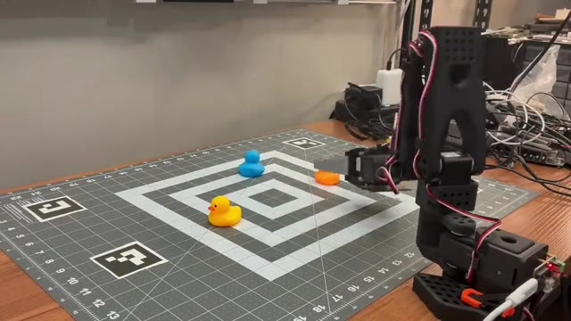</a> | **Zero-shot control of a physical robot arm, no trained policy** [Zaid Bulbul (@zaidbul)](https://x.com/zaidbul/status/2100949713138729135), X, 2026-09-18 Author: "have not seen anyone actually using Jev for robotics outside of a simulation, so here is Jev running with no policy, zero-shot controlling the robotic arm." The post names neither the arm nor the action interface. Setup: physical robot arm on a tagged grid mat (model not named in the post) · Archived copy: [video, 49 s](https://frank-zy-dou.github.io/awesome-jev/assets/videos/jev-003-zero-shot-physical-robotic-arm-dem-zaidbul.mp4) |

## Robot control in simulation

Jev picks discrete actions or targets from structured state; the simulator or a script executes them. Environments were checked in the archived videos.

| Preview | Case |
|---|---|
| <a href="https://frank-zy-dou.github.io/awesome-jev/assets/videos/jev-004-askable-arm-natural-language-robot-taratt.mp4">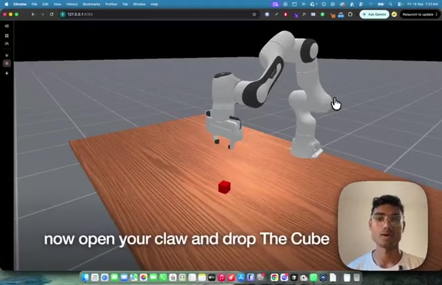</a> | **Askable Arm: plain-English goals chained from hard-coded primitives** [Tarun Tomar](https://www.linkedin.com/posts/taratt_zero-shot-robot-tasks-with-the-new-typesafe-activity-7506600373059588096-FlJN), LinkedIn, 2026-09-18 Post: "Give it a goal in plain English. Jev chains a set of hard-coded primitives. The arm does the thing." The repository's README adds the details: a "menu of ~30 primitives", "Jev never outputs torques or a trajectory. It picks one primitive per step", "No images go to Jev" (it receives privileged simulator state), ManiSkill tasks PickCube-v1 and ResetButton-v7 at seed 0, and "~1 second per Jev pick". Setup: ManiSkill simulation, Franka Panda · Archived copy: [video, 111 s](https://frank-zy-dou.github.io/awesome-jev/assets/videos/jev-004-askable-arm-natural-language-robot-taratt.mp4) Links: [code (jev-askable-arm)](https://github.com/TarunTomar122/jev-askable-arm) |
| <a href="https://frank-zy-dou.github.io/awesome-jev/assets/videos/jev-005-two-stage-jev-control-in-mujoco-dimentary.mp4">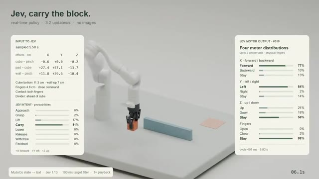</a> | **Two calls per step: what to do, then how to move** [Dmytro Hrybov (@dimentary)](https://x.com/dimentary/status/2101018760371171420), X, 2026-09-18 Author: "tested Jev as a real-time robotics policy in MuJoCo. it struggled at first, so i split each update into two calls: decide what to do next, then decide how to move the arm and gripper." On inputs: "Jev doesn't accept images, it gets simplified geometry and contacts as text here." Setup: MuJoCo robot-arm simulation · Archived copy: [video, 20 s](https://frank-zy-dou.github.io/awesome-jev/assets/videos/jev-005-two-stage-jev-control-in-mujoco-dimentary.mp4) |
| <a href="https://frank-zy-dou.github.io/awesome-jev/assets/videos/jev-006-makermods-metal-arm-in-mujoco-isaacsin12.mp4">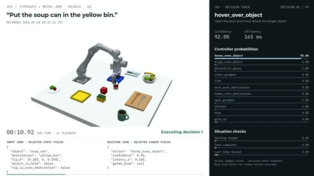</a> | **MakerMods Metal arm in MuJoCo: typed actions with confidence** [Isaac Sin (@IsaacSin12)](https://x.com/IsaacSin12/status/2100833538224668699), X, 2026-09-18 The simulator passes scene state to Jev as JSON; the camera image is not passed. Jev "picks the next bounded action (hover, descend, grasp, lift, place) as a typed choice with a confidence score". For "Put the red apple in the blue bin" the author reports "9 decisions at ~150 ms each", and that Jev "refuses tasks it can't map to the scene instead of guessing". Setup: MuJoCo simulation of the MakerMods Metal arm · Archived copy: [video, 36 s](https://frank-zy-dou.github.io/awesome-jev/assets/videos/jev-006-makermods-metal-arm-in-mujoco-isaacsin12.mp4) |
| <a href="https://frank-zy-dou.github.io/awesome-jev/assets/videos/jev-007-mujoco-apple-to-plate-controller-c-openroboto.mp4">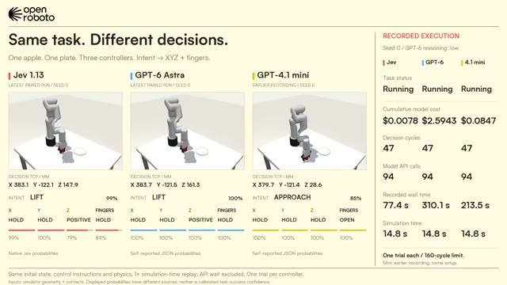</a> | **Jev, GPT-6 Astra and GPT-4.1 mini on an apple-to-plate task** [OpenRoboto (@openroboto)](https://x.com/openroboto/status/2101310974359941332), X, 2026-09-19 Post: "We compared Jev, GPT-6 Astra and GPT-4.1 mini in MuJoCo. One apple. One plate. Each model chooses intent → X/Y/Z direction + gripper open/hold/close." The video's own captions set the conditions: "One trial per controller", seed 0, "GPT-6 reasoning: low", inputs "simulator geometry + contacts", GPT-4.1 mini from an "earlier recording, same setup", a 160-cycle limit, and "Displayed probabilities have different sources; neither is calibrated task-success confidence." The rest of the thread was not read; the RobotWorld mirror summarizes it as "Jev 1.13 and GPT-6 Astra place it; GPT-4.1 mini hits the 160-cycle limit. Jev cost $0.0188 vs $5.9336." Setup: MuJoCo manipulation simulation · Archived copy: [video, 59 s](https://frank-zy-dou.github.io/awesome-jev/assets/videos/jev-007-mujoco-apple-to-plate-controller-c-openroboto.mp4) Links: [mirror with the thread summary (RobotWorld)](https://robot.agientry.com/en/robotvideos/twitter-openroboto-2101310974359941332) |
| <a href="https://frank-zy-dou.github.io/awesome-jev/assets/videos/jev-009-moss-litter-picking-target-selecti-metroxeth.mp4">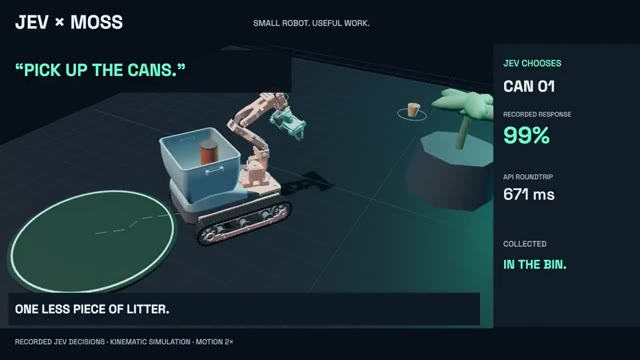</a> | **MOSS litter-picking: Jev chooses the target, replayed in simulation** [metr0x (@metrox_eth)](https://x.com/metrox_eth/status/2101021471644733867), X, 2026-09-18 Author: "Jev picks the target. MOSS picks up the litter. 'Pick up the cans.' Now change the instruction: 'Pick up the bottles.' Real Jev decisions, replayed in simulation." The project page describes the loop as "Structured state → Jev → robot action" using "recorded API responses". Setup: simulation replay of recorded Jev decisions · Archived copy: [video, 18 s](https://frank-zy-dou.github.io/awesome-jev/assets/videos/jev-009-moss-litter-picking-target-selecti-metroxeth.mp4) Links: [project page (MOSS × JEV)](https://www.showrobotics.ai/moss-jev/) |
| <a href="https://frank-zy-dou.github.io/awesome-jev/assets/videos/jev-008-multi-stage-manipulation-with-conf-jonyshaik.mp4">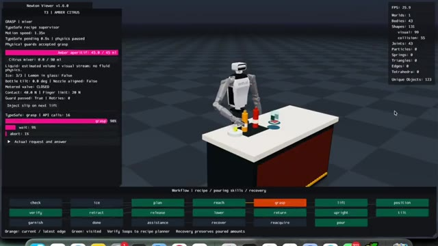</a> | **Multi-stage manipulation with confidence gates** [Jony Shaik (@JonyShaik)](https://x.com/JonyShaik/status/2100827590781214981), X, 2026-09-18 Author: "Jev handles the high-level task transitions and confidence gating at each boundary, while deterministic physics guards manage execution." The video shows a simulated humanoid pouring at a table, with a skill list and guard messages on screen. Setup: simulated humanoid at a table (per the video; the post does not say) · Archived copy: [video, 53 s](https://frank-zy-dou.github.io/awesome-jev/assets/videos/jev-008-multi-stage-manipulation-with-conf-jonyshaik.mp4) |
| <a href="https://frank-zy-dou.github.io/awesome-jev/assets/videos/jev-010-exploratory-robotic-arm-decisions-arpantripathi20.mp4">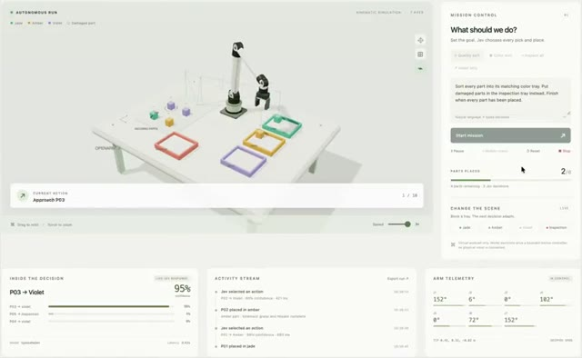</a> | **Early robot-arm experiment** [Arpan (@ArpanTripathi20)](https://x.com/ArpanTripathi20/status/2101011926301991070), X, 2026-09-18 Author: "Seems Jev can control robot arms. Need more iterations to make its degrees of freedom broader." Nothing more is stated in the post; the video shows a simulated arm placing objects on a table with a chat panel beside it. Setup: simulated arm in a browser-style interface (per the video; the post gives no details) · Archived copy: [video, 28 s](https://frank-zy-dou.github.io/awesome-jev/assets/videos/jev-010-exploratory-robotic-arm-decisions-arpantripathi20.mp4) |
| <a href="https://frank-zy-dou.github.io/awesome-jev/assets/videos/jev-011-microduck-obstacle-navigation-ostynhyss.mp4">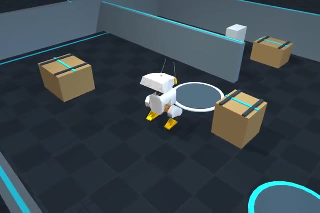</a> | **Microduck navigates around obstacles to a goal** [ostyn (@ostynhyss)](https://x.com/ostynhyss/status/2100987585384345890), X, 2026-09-18 Author: "I plugged Jev into a version of @huggingface Microduck and it can navigate environments with obstacles to reach a goal destination!" On cost: "I played around in this project for hours, accross multiple days, and only spent $0.34." Sensors and the low-level controller are not described. Setup: a version of Hugging Face's Microduck in a simulated room (per the video) · Archived copy: [video, 32 s](https://frank-zy-dou.github.io/awesome-jev/assets/videos/jev-011-microduck-obstacle-navigation-ostynhyss.mp4) |

## 3D modeling, animation and virtual cameras

Jev as an evaluator, an animation orchestrator, an agent brain and a camera planner.

| Preview | Case |
|---|---|
| <a href="https://frank-zy-dou.github.io/awesome-jev/assets/videos/jev-001-blender-airplane-modeling-with-jev-sxfyhvx.mp4">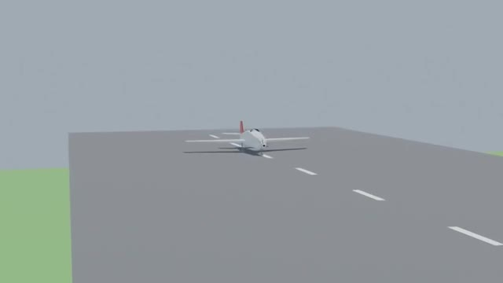</a> | **Blender airplane model, with Jev as the evaluation standard** [Har (@Sxfyhvx)](https://x.com/Sxfyhvx/status/2100929250882691464), X, 2026-09-18 Author: a chat model reached through OpenCode was asked "to help me create a 3D airplane model in Blender, using JEV as the evaluation standard. The results are really impressive." Jev's role here is evaluation; the geometry comes from the other model. Setup: Blender, OpenCode, a separate chat model · Archived copy: [video, 8 s](https://frank-zy-dou.github.io/awesome-jev/assets/videos/jev-001-blender-airplane-modeling-with-jev-sxfyhvx.mp4) |
| <a href="https://frank-zy-dou.github.io/awesome-jev/assets/videos/jev-015-live-3d-character-expressions-for-johnbortotti.mp4">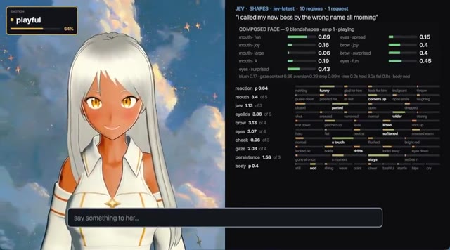</a> | **A 3D character's whole performance, ten decisions per message** [Joao Bortotti (@john_bortotti)](https://x.com/john_bortotti/status/2101019513676345555), X, 2026-09-18 Author: "I'm using @typesafeai's Jev to orchestrate a 3D character's entire performance. Mouth, brows, eyes, cheeks, gaze and body: ten decisions per message, composed live into one coherent reaction. No preset expressions." Setup: interactive 3D character (Mutuals) · Archived copy: [video, 26 s](https://frank-zy-dou.github.io/awesome-jev/assets/videos/jev-015-live-3d-character-expressions-for-johnbortotti.mp4) |
| <a href="https://frank-zy-dou.github.io/awesome-jev/assets/videos/jev-016-real-time-agents-in-a-3d-environme-crislenta.mp4">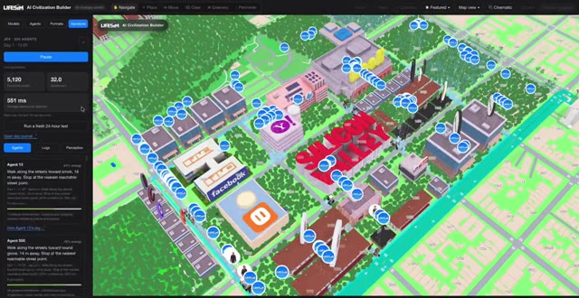</a> | **500 real-time agents in one 3D environment** [Cris Lenta (@crislenta)](https://x.com/crislenta/status/2100457614073327754), X, 2026-09-17 Author: "500 real-time agents running in parallel in a 3D environment"; preliminary numbers "500ms average latency, 35 API calls/s, all with a naive implementation. We did 0 optimizations!" The agents' decisions, not the 3D assets, come from Jev. Setup: 3D multi-agent scene · Archived copy: [video, 24 s](https://frank-zy-dou.github.io/awesome-jev/assets/videos/jev-016-real-time-agents-in-a-3d-environme-crislenta.mp4) |
| <a href="https://frank-zy-dou.github.io/awesome-jev/assets/videos/jev-017-natural-language-camera-moves-in-a-carrabre.mp4">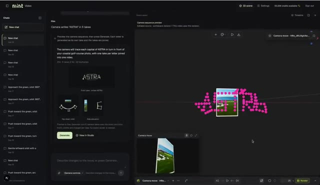</a> | **Natural-language camera moves for a video editing tool** [Alex Carrabre (@carrabre)](https://x.com/carrabre/status/2101035345643221239), X, 2026-09-18 Author: "Jev converts natural language to precise camera movements (ie spelling ASTRA) by answering a few calibrated multiple-choice questions (move kind, plus direction and magnitude band per camera axis) By creating keyframes it emits a structured trajectory (time/azimuth/elevation/distance) and it's checked before rendering". The post also claims "~230x faster planning" without stating the baseline. Setup: editing tool built on mint.gg · Archived copy: [video, 41 s](https://frank-zy-dou.github.io/awesome-jev/assets/videos/jev-017-natural-language-camera-moves-in-a-carrabre.mp4) |

## Vehicles, drones and games in simulation

Control loops in simulators and games. None of these involves a real vehicle or aircraft.

| Preview | Case |
|---|---|
| <a href="https://frank-zy-dou.github.io/awesome-jev/assets/videos/jev-012-jev-driving-simulator-jpschroeder.mp4">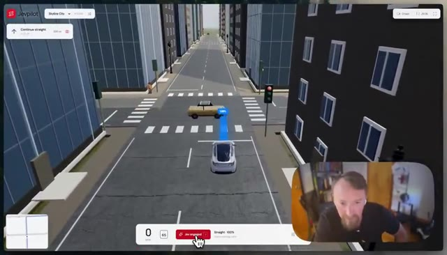</a> | **A driving simulator built around Jev** [Justin Schroeder (@jpschroeder)](https://x.com/jpschroeder/status/2100347770867458384), X, 2026-09-16 Author: "I rebuilt Tesla Full Self Driving with Jev in less than an hour." The post has no further technical detail; the video shows a simulated car. This is not a claim about a real vehicle. Setup: driving simulator (see the video) · Archived copy: [video, 120 s](https://frank-zy-dou.github.io/awesome-jev/assets/videos/jev-012-jev-driving-simulator-jpschroeder.mp4) |
| <a href="https://frank-zy-dou.github.io/awesome-jev/assets/videos/jev-013-autonomous-driving-decision-simula-cipherwrk.mp4">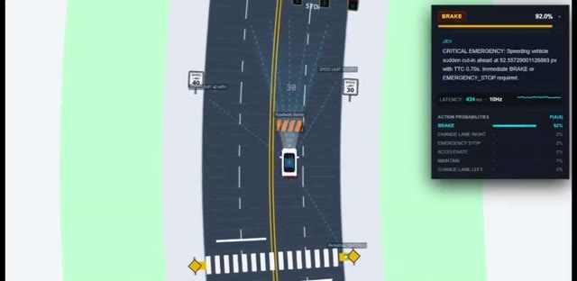</a> | **Discrete driving decisions from live environment state** [Cipher (@cipherwrk)](https://x.com/cipherwrk/status/2100965547454374316), X, 2026-09-18 Author: the system "receives real time data from its environment & decides what to do next. Change lanes, Brake, Accelerate, Slow down. With sudden obstacles, pedestrians, traffic & red lights." The author calls it "A small experiment in what decision native AI can look like". Setup: driving simulator (see the video) · Archived copy: [video, 116 s](https://frank-zy-dou.github.io/awesome-jev/assets/videos/jev-013-autonomous-driving-decision-simula-cipherwrk.mp4) |
| <a href="https://frank-zy-dou.github.io/awesome-jev/assets/videos/jev-014-drone-navigation-through-an-astero-mkhordoo.mp4">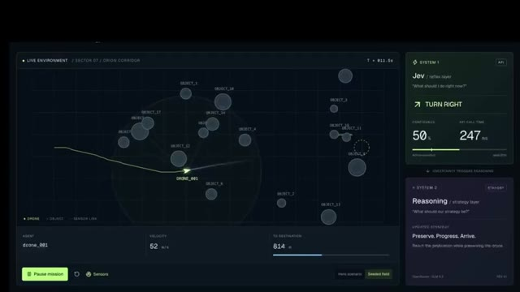</a> | **Virtual drone through an asteroid field, with a fallback to a larger model** [Mahmoud (@MKhordoo)](https://x.com/MKhordoo/status/2100950317852455039), X, 2026-09-18 Author: "300ms decisions. Left / right / slow / accelerate." The overlay shows "Green = Jev's own confidence. Purple = 'I'm not sure, ask the big model.'" and "99% of the time, Jev steered the drone on its own"; "the larger model only steps in when uncertainty is high". Setup: virtual asteroid-field environment · Archived copy: [video, 37 s](https://frank-zy-dou.github.io/awesome-jev/assets/videos/jev-014-drone-navigation-through-an-astero-mkhordoo.mp4) |
| <a href="https://frank-zy-dou.github.io/awesome-jev/assets/videos/jev-021-jev-rocket-in-kerbal-space-program-textlayerai.mp4">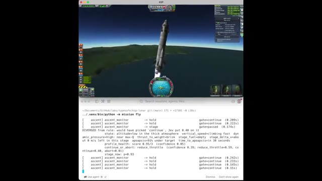</a> | **Jev flies a rocket in Kerbal Space Program** [TextLayer (@textlayerai)](https://x.com/textlayerai/status/2100998343254257898), X, 2026-09-18 Post: "Gareth, our AI Architect, did the obvious thing: gave @typesafeai's Jev control of a rocket in Kerbal Space Program. TL;DR: this is very cool. His learnings in the comments." The comments were not read. Setup: Kerbal Space Program · Archived copy: [video, 124 s](https://frank-zy-dou.github.io/awesome-jev/assets/videos/jev-021-jev-rocket-in-kerbal-space-program-textlayerai.mp4) |

## Design tools and robotics data

Design-tool control and offline evaluation of robot data.

| Preview | Case |
|---|---|
| <a href="https://frank-zy-dou.github.io/awesome-jev/assets/videos/jev-019-voice-controlled-figma-mikegee.mp4">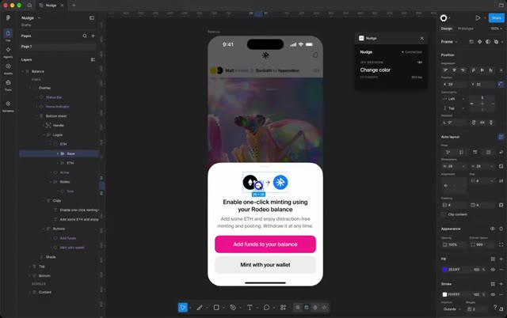</a> | **Controlling Figma by voice** [mikegee (@mikegee)](https://x.com/mikegee/status/2100845388655960112), X, 2026-09-18 Author: "Controlling Figma with voice using Jev from @typesafeai. Total cost from first line of code to recording this video: $0.01." The speech and execution pipeline is not described. Setup: Figma · Archived copy: [video, 33 s](https://frank-zy-dou.github.io/awesome-jev/assets/videos/jev-019-voice-controlled-figma-mikegee.mp4) |
| <a href="https://frank-zy-dou.github.io/awesome-jev/assets/videos/jev-020-figma-requirements-checker-w33baker.mp4">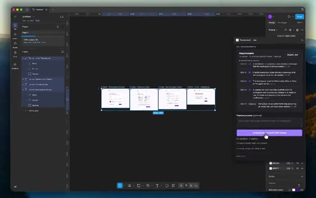</a> | **Figma plugin that checks designs against a requirements document** [Furkan (@W33baker)](https://x.com/W33baker/status/2100927795484369231), X, 2026-09-18 Author: "you give it a requirements doc, select your frames, and it tells you which requirements actually show up in the designs and which don't. Seems pretty good honestly." Setup: Figma plugin · Archived copy: [video, 33 s](https://frank-zy-dou.github.io/awesome-jev/assets/videos/jev-020-figma-requirements-checker-w33baker.mp4) |
| <a href="https://www.linkedin.com/posts/antopatrex_we-ran-typesafe-ais-jev-eval-model-on-humanoid-robot-activity-7507141761530503168-87S3">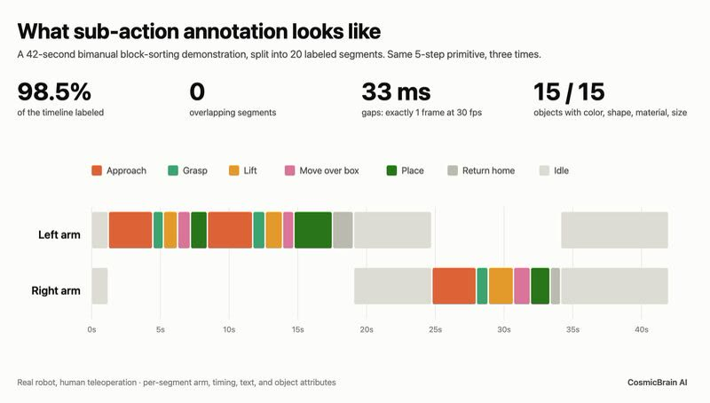</a> | **Evaluating humanoid teleoperation data: label consistency and segmentation** [Anto Patrex](https://www.linkedin.com/posts/antopatrex_we-ran-typesafe-ais-jev-eval-model-on-humanoid-robot-activity-7507141761530503168-87S3), LinkedIn, 2026-09-19 Author: "We ran TypeSafe AI's JEV eval model on humanoid-robot teleop data from deployment sites. 99% label consistency. 91% annotation completeness." A "42s bimanual task" was split "into 20 segments: approach, grasp, lift, move, place, three times over", with "98.5% of the timeline labeled. Zero overlaps. 33ms gaps". The author's caveat: "'n' is minimum, and it's a sorting task". Offline data evaluation, not robot control. Setup: recorded humanoid-robot teleoperation data · Archived copy: [image 1](assets/images/jev-018-humanoid-teleoperation-data-qualit-antopatrex-1.jpg) · [image 2](assets/images/jev-018-humanoid-teleoperation-data-qualit-antopatrex-2.jpg) · [image 3](assets/images/jev-018-humanoid-teleoperation-data-qualit-antopatrex-3.jpg) |

## Reported numbers

Numbers stated by the authors of the posts above, in their own setups. None has been reproduced independently; each row links the post that states it.

| Number | What it describes | Reported by | Source |
|---|---|---|---|
| ~2 decisions per second | next-move rate on a physical SO-101 arm | Daniiar Abdiev | [X, 2026-09-18](https://x.com/DaniiarAbdiev/status/2100851116498186415) |
| 9 decisions at ~150 ms each | "Put the red apple in the blue bin" on a simulated MakerMods Metal arm | Isaac Sin | [X, 2026-09-18](https://x.com/IsaacSin12/status/2100833538224668699) |
| ~1 second per Jev pick | one primitive chosen per step on a simulated Franka Panda | Tarun Tomar | [README](https://github.com/TarunTomar122/jev-askable-arm) |
| Jev cost $0.0188 vs $5.9336; GPT-4.1 mini "hits the 160-cycle limit" | one MuJoCo apple-to-plate trial per controller (Jev 1.13, GPT-6 Astra at low reasoning, GPT-4.1 mini), seed 0 | OpenRoboto; totals as summarized by the RobotWorld mirror, conditions from the video captions | [mirror](https://robot.agientry.com/en/robotvideos/twitter-openroboto-2101310974359941332), [post](https://x.com/openroboto/status/2101310974359941332) |
| 300 ms decisions; "99% of the time, Jev steered the drone on its own" | virtual drone in an asteroid field, with a larger-model fallback | Mahmoud | [X, 2026-09-18](https://x.com/MKhordoo/status/2100950317852455039) |
| 500 agents; 500 ms average latency; 35 API calls/s | real-time agents in a 3D environment, "naive implementation" | Cris Lenta | [X, 2026-09-17](https://x.com/crislenta/status/2100457614073327754) |
| ten decisions per message | facial and body performance of a 3D character | Joao Bortotti | [X, 2026-09-18](https://x.com/john_bortotti/status/2101019513676345555) |
| "~230x faster planning" (baseline not stated) | camera planning in an editing tool | Alex Carrabre | [X, 2026-09-18](https://x.com/carrabre/status/2101035345643221239) |
| $0.34 over hours of use across multiple days | Microduck navigation experiments | ostyn | [X, 2026-09-18](https://x.com/ostynhyss/status/2100987585384345890) |
| $0.01 "from first line of code to recording this video" | voice control of Figma | mikegee | [X, 2026-09-18](https://x.com/mikegee/status/2100845388655960112) |
| 99% label consistency; 91% annotation completeness; 98.5% of the timeline labeled; 33 ms gaps | humanoid teleoperation data, small sample ("'n' is minimum") | Anto Patrex | [LinkedIn, 2026-09-19](https://www.linkedin.com/posts/antopatrex_we-ran-typesafe-ais-jev-eval-model-on-humanoid-robot-activity-7507141761530503168-87S3) |

Vendor claims from the announcement ("20-200x faster", "40-400x cheaper") are not benchmarks and are listed only in [About Jev](#about-jev).

## GitHub projects

- [TarunTomar122/jev-askable-arm](https://github.com/TarunTomar122/jev-askable-arm): "Zero-shot English goals on a sim Franka. Jev chains hardcoded primitives." Linked from the author's LinkedIn post above; README read on 2026-09-19.

## Directories and coverage

- [jevable.com](https://jevable.com/): a directory of community projects built with Jev, indexed by X post ("Explore 359 curated projects built with Jev" on 2026-09-19). Several posts above were first found there.
- [systemonemodels.org](https://systemonemodels.org/): "the independent hub for AI decision models", with use cases and examples for Jev.
- [RobotWorld](https://robot.agientry.com/en/robotvideos/twitter-openroboto-2101310974359941332): mirror of the MuJoCo controller comparison, with a one-line summary of the thread.

## About the archived media

Video links open the file from this repository's GitHub Pages site (https://frank-zy-dou.github.io/awesome-jev/), which serves them as playable MP4; the same files sit under `assets/videos` in the repository tree. The videos are re-encoded copies of the media attached to the linked posts (H.264, at most 540p); images are resized to at most 1280 px wide. Nothing is cut or edited. Files are named by case id, project and author, for example `assets/videos/jev-002-so-101-ball-to-bowl-manipulation-daniiarabdiev.mp4`. Authors who want a file removed can open an issue.

## Contributing

Open a pull request that adds a row to the matching table with the original post URL, the author, the date, one or two sentences that stick to what the post says, the setup the post names, and an archived copy of the media under `assets/`. Reposts go on the original case's row. Numbers need a link to the page where the number appears.
